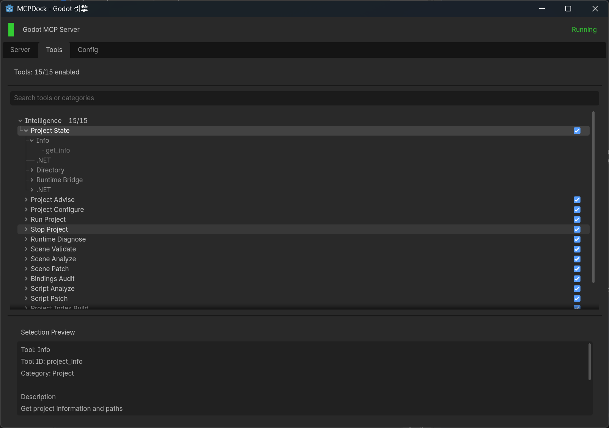

# Godot .NET MCP
[](https://github.com/LuoxuanLove/godot-dotnet-mcp/releases/latest)
[](README.zh-CN.md)

> v1.0 is being refactored around one public MCP host: `Central Server`. The Godot plugin now acts as the editor-side agent that attaches on demand and exposes live editor capabilities when they are needed.



## Product Model

- `Central Server` is the only public MCP entry point.
- `workspace_*` and `dotnet_*` are host-native tools and can run without opening Godot.
- `system_*` are editor-attached tools. The host resolves the project, launches or reuses Godot when needed, and forwards the call through the plugin session.
- The Godot plugin is no longer the primary public server. It is the editor-side runtime, attach client, local diagnostics UI, and live tool executor.
- The legacy `dotnet_bridge/` product shell has been removed. Shared host-side `.NET` implementations now live in `host_shared/`.

## Repository Layout

- `central_server/`
  The external host, project registry, editor launch flow, and public MCP stdio server.
- `host_shared/`
  Shared host-side `.NET` tools, installer logic, and reusable infrastructure used by `Central Server`.
- `addons/godot_dotnet_mcp/`
  The Godot plugin that attaches to the host and executes editor-required tools.
- `scripts/publish_central_server.ps1`
  Packaging entry point that produces `dist/central-server-win-x64`, `dist/plugin-lean`, and `dist/plugin-bundled-win-x64`.
- `docs/`
  Architecture, module, installation, and release documentation.

## Installation

### Option 1: Recommended release workflow

Download the latest release assets from:

```text
https://github.com/LuoxuanLove/godot-dotnet-mcp/releases
```

Use one of these packages:

- `central-server-win-x64`
  Install the standalone host and point your MCP client to `GodotDotnetMcp.CentralServer --stdio`.
- `plugin-lean`
  Install the Godot plugin only. Use this when the host is installed separately.
- `plugin-bundled-win-x64`
  Install the plugin plus a bundled local bootstrap package for the host.

### Option 2: Source/development workflow

Copy the plugin into your Godot project:

```text
addons/godot_dotnet_mcp
```

Then:

1. Open the project in Godot.
2. Go to `Project Settings > Plugins`.
3. Enable `Godot .NET MCP`.
4. Open `MCPDock`.
5. Use the `Server` tab to detect, install, or inspect the local `Central Server`.

## Quick Start

### 1. Install and verify the host

For local verification:

```bash
dotnet run --project central_server/CentralServer.csproj -- --health
dotnet run --project central_server/CentralServer.csproj -- --help
```

### 2. Enable the plugin in Godot

The plugin is required for live editor tools such as:

- `system_project_state`
- `system_runtime_diagnose`
- `system_scene_analyze`
- `system_script_analyze`
- `system_bindings_audit`

The plugin also keeps local diagnostics, attach status, and `user_*` custom tool runtime state visible inside `MCPDock`.

### 3. Connect your MCP client to Central Server

The main stdio entry point is:

```text
GodotDotnetMcp.CentralServer --stdio
```

Recommended flow:

1. Register or select a project with `workspace_project_*`.
2. Use `dotnet_*` and `workspace_*` directly for static work.
3. Call `system_*` when you need live Godot editor state.
4. Let `Central Server` attach to an existing editor session or launch Godot when required.

## Custom Tools

User extensions still live in:

```text
addons/godot_dotnet_mcp/custom_tools/
```

Each `.gd` file should implement `handles()`, `get_tools()`, and `execute()`, and expose tool names prefixed with `user_`.

## Release And Refactor Notes

- `Central Server` is the v1.0 product line.
- The repository no longer tracks bundled host zip artifacts in source control.
- Bundled packages are injected into release output only, not copied back into the source tree.
- The legacy `Dotnet Bridge` product shell has been removed.
- `Central Server` uses `host_shared/` for shared `.NET` tool implementations.

## Docs

- [README.zh-CN.md](README.zh-CN.md)
- [addons/godot_dotnet_mcp/README.md](addons/godot_dotnet_mcp/README.md)
- [docs/概述.md](docs/概述.md)
- [docs/架构/服务与路由.md](docs/架构/服务与路由.md)
- [docs/架构/安装与发布.md](docs/架构/安装与发布.md)

## Current Boundaries

- The v1.0 refactor is still in progress.
- Some plugin-side HTTP and compatibility routes remain during the transition, but they are not the long-term public entry point.
- The temporary refactor planning documents under `agent_workflow/10_开发计划/` stay in place until the user explicitly confirms that the refactor is finished.
