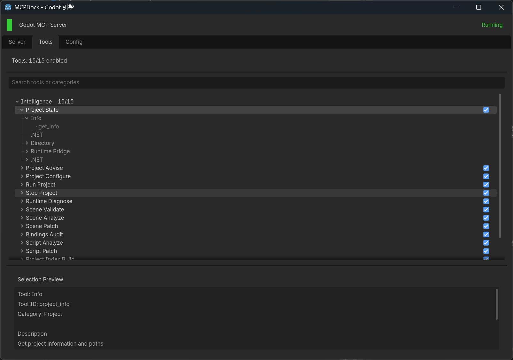

# Godot .NET MCP
[](https://github.com/LuoxuanLove/godot-dotnet-mcp/releases/latest)
[](README.zh-CN.md)

> A plugin-internal MCP server: Roslyn syntax analysis runs inside the Godot .NET runtime.



## Product Model

- The Godot plugin exposes an in-process MCP endpoint via HTTP.
- C# analysis uses plugin-internal Roslyn (syntax-only, syntax-first).
- `system_*` tools read live editor state from within the running Godot process.
- No child process fallback.

## Repository Layout

- `addons/godot_dotnet_mcp/`
  The Godot plugin: MCP HTTP server, tool routing, runtime services, and the plugin-internal Roslyn façade.
- `addons/godot_dotnet_mcp/dotnet_bridge/`
  Plugin-internal Roslyn syntax library used by the façade.
- `tests/godot_plugin_harness/`, `tests/godot_plugin_harness_fixture/`
  Headless harness for plugin runtime verification.
- `docs/`
  Architecture, module, and release documentation.

## Installation

### Option 1: Release package

Download the latest release from:

```text
https://github.com/LuoxuanLove/godot-dotnet-mcp/releases
```

Extract so the structure is:

```text
addons/godot_dotnet_mcp
```

Then:

1. Open the project in Godot.
2. Go to `Project Settings > Plugins`.
3. Enable `Godot .NET MCP`.
4. Open `MCPDock`.
5. Start the service from the `Home` tab.

### Option 2: Source / development workflow

Copy the plugin into your Godot project:

```text
addons/godot_dotnet_mcp
```

Then follow steps 1-5 above.

## Requirements

- Godot `4.6+` with .NET support (Mono/.NET build)
- An MCP client such as Claude Code, Codex CLI, Gemini CLI, Claude Desktop, or Cursor

## Quick Start

### 1. Enable the plugin

The plugin is required for live editor tools:

- `system_project_state`
- `system_help`
- `system_editor_state`
- `system_runtime_diagnose`
- `system_scene_analyze`
- `system_script_analyze`
- `system_bindings_audit`

### 2. Connect your MCP client

The MCP endpoint is `http://127.0.0.1:3000/mcp` (or the current port shown in `MCPDock > Home`).

Configure your MCP client to connect to that HTTP endpoint.

### 3. Verify

- `GET http://127.0.0.1:3000/health` returns normally.
- `GET http://127.0.0.1:3000/api/tools` returns the tool list.
- `system_help` returns the current capability guide, including editor screenshot guidance and hidden-control enumeration hints.

## Custom Tools

User extensions live in:

```text
addons/godot_dotnet_mcp/custom_tools/
```

Each `.gd` file should implement `handles()`, `get_tools()`, and `execute()`, with tool names prefixed `user_`.

## Architecture Notes

- C# parsing is handled by plugin-internal Roslyn running inside the Godot .NET runtime.
- The analysis is syntax-first: only syntax tree information is extracted, no SemanticModel or project compilation.
- The `addons/godot_dotnet_mcp/dotnet_bridge/` directory contains the plugin-internal Roslyn syntax library.
- No attach protocol, no child process — the plugin is self-contained.

## Docs

- [README.zh-CN.md](README.zh-CN.md)
- [addons/godot_dotnet_mcp/README.md](addons/godot_dotnet_mcp/README.md)
- [docs/概述.md](docs/概述.md)
- [docs/架构/概述.md](docs/架构/概述.md)
- [docs/架构/安装与发布.md](docs/架构/安装与发布.md)
