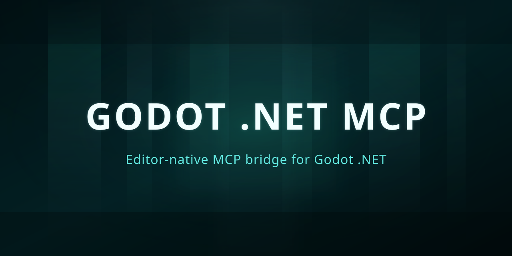
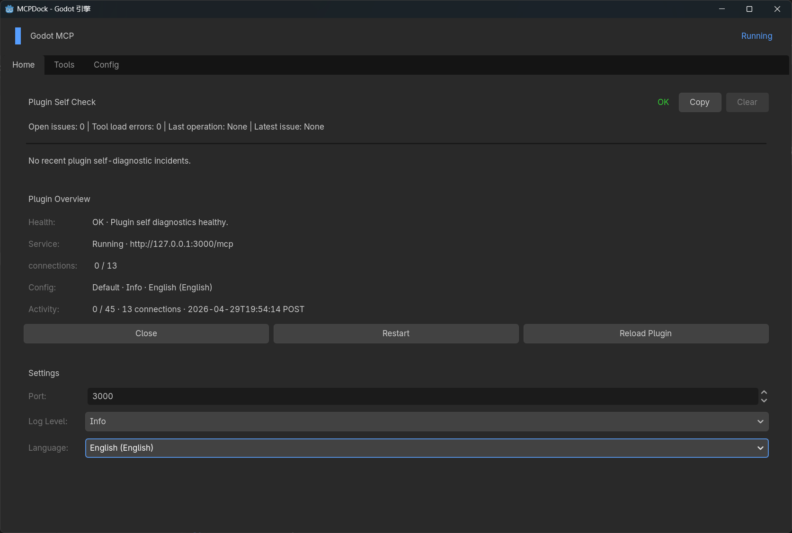
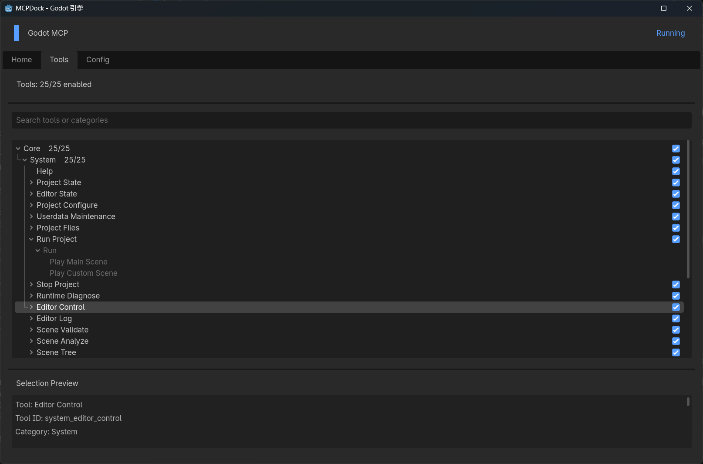
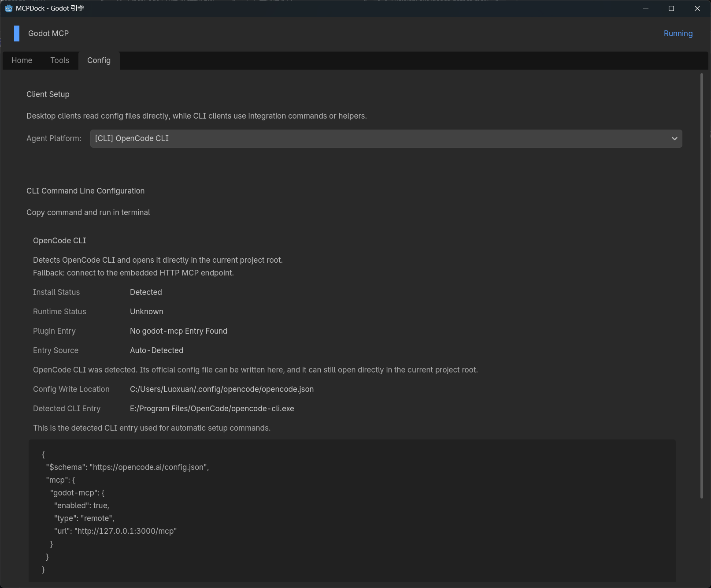

<div align="center">
  <a href="#godot-net-mcp"></a>
</div>

<p align="center"><a href="https://github.com/LuoxuanLove/godot-dotnet-mcp/releases/latest"></a> <a href="https://godotengine.org/"></a> <a href="https://dotnet.microsoft.com/"></a> <a href="https://godotengine.org/asset-library/asset/4923"></a> <a href="LICENSE"></a></p>

<p align="center"><a href="README.md">English</a> | <a href="docs/i18n/ko/README.md">한국어</a> | <a href="docs/i18n/ja/README.md">日本語</a> | <a href="docs/i18n/zh-CN/README.md">简体中文</a></p>

| Home | Tools | Config |
|---|---|---|
|  |  |  |

# Godot .NET MCP

Godot .NET MCP is an in-editor MCP plugin for Godot 4.6+ .NET projects. It runs directly inside the Godot editor and provides real-time project context to MCP-capable clients, including editor state, the current scene, selected nodes, run information, diagnostics, and screenshots.

The MCP service is built into the Godot plugin. Enable the plugin and start the service from the Dock; you do not need to run any extra background process.

## Why It Exists

A Godot project is more than a pile of `.tscn`, `.tres`, and script files.

The scene you are looking at, the currently selected node, editor output, game runtime view and state, recent errors, and plugin configuration all affect what a change should look like. Godot .NET MCP collects that in-editor context and provides it to MCP clients, so they no longer have to guess the project state from a directory snapshot alone.

If your work mostly happens in the Godot editor and the game runtime, not just in code files, this plugin will be useful.

## Highlights

|       | Feature | What it does |
| :---: | :--- | :--- |
| 🎛️ | **Runs with the editor** | The MCP service is provided directly by the Godot plugin, with no extra background process required. |
| 🚀 | **Low-friction setup** | Install it from the Godot Asset Library, generate connection settings for common MCP clients, and update the plugin from GitHub sources. |
| 🎮 | **Live Godot editor context** | Provides your agent with the current scene, selected nodes, Dock state, logs, run information, diagnostics summaries, and editor screenshots. |
| 🌳 | **Scene, resource, and binding diagnostics** | Helps inspect scene trees, resource references, dependencies, scene structure issues, and C# export binding state. |
| ▶️ | **Game runtime support** | Starts and stops scenes, inspects runtime diagnostics, performs input, and captures game runtime views. |
| 🔎 | **Roslyn-based C# support** | Uses the plugin's internal Roslyn syntax checks to read C# script structure, including classes, base types, methods, enums, and exported members. |
| 🐞 | **Godot DAP debugging** | Reads breakpoints, threads, stack traces, and output events through Godot DAP, and performs pause, continue, and step-over actions for Godot script debugging; managed C# breakpoints still require a separate .NET debugger. |
| 📚 | **MCP Resources and Prompts** | Provides project resources, diagnostics read entry points, and common Godot workflow Prompt Guides. |
| 🧰 | **Tool extensions** | Optionally hot-loads `user_*` GDScript tools from `custom_tools/`, so projects can add their own MCP capabilities. |

## Installation

### From the Godot Asset Library

1. Open your project in Godot.
2. Open the `AssetLib` tab.
3. Search for `Godot .NET MCP`.
4. Install the plugin.
5. Go to `Project Settings > Plugins` and enable `Godot .NET MCP`.
6. Open `MCPDock` and start the service from `Home`.

### From Source

Copy the plugin source directory into your Godot project:

```text
addons/godot_dotnet_mcp
```

Then enable it from `Project Settings > Plugins`.

## First Use

1. Install and enable the plugin in a Godot 4.6+ .NET project.
2. Open `MCPDock`.
3. Start the MCP service from `Home`.
4. Generate or copy your MCP client configuration from the config page.
5. Return to the client and connect to the service, then let it read the current Godot project state.

## Documentation

- [한국어 README](docs/i18n/ko/README.md)
- [日本語 README](docs/i18n/ja/README.md)
- [简体中文 README](docs/i18n/zh-CN/README.md)
- [Changelog](CHANGELOG.md)
- [Roadmap](ROADMAP.md)
- [Documentation overview](docs/概述.md)
- [Installation and release](docs/架构/安装与发布.md)
- [User extensions](docs/模块/用户扩展.md)

## Author's Note

Although I am only a student, I am deeply passionate about making games. I once wrote an entire rhythm game project by myself the old-fashioned way. To be honest, wrestling with code details and debugging was painful.

In the AI era, everything changed, and code became cheap. After discovering great concepts like agents and MCP, I was ecstatic. I wanted AI to turn my ideas into reality simply and quickly, and to autonomously complete design, development, validation, and everything else.

So I decided to write this MCP plugin myself, and to use it personally while building my own game. This great plugin will be battle-tested by me in real work; I will hit the pitfalls first, polish it, and fix it for you.

Even though 100% of this project's code is generated directly by AI, I have prepared the strictest automated checks, development flow, and release flow I can, so AI-written code is verified as much as possible before it enters an official version.

After reading all this, why not try Godot .NET MCP? I will keep studying the market, stealing the strongest ideas, and updating them here; it will become the tightest connection between your agent and your game project.

Does that sound arrogant? Maybe. If you have a more badass implementation idea, send a PR. You are very welcome!

## License

MIT. See [LICENSE](LICENSE).
