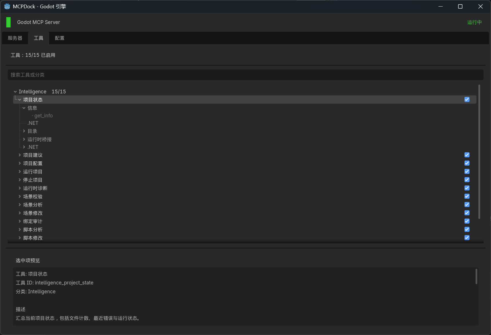

# Godot .NET MCP
[](https://github.com/LuoxuanLove/godot-dotnet-mcp/releases/latest)
[](README.md)

> v1.0 正在围绕单一公开入口 `Central Server` 进行重构。Godot 插件现在定位为编辑器侧代理，只在需要实时编辑器能力时按需附着并执行工具。



## 产品模型

- `Central Server` 是唯一对外公开的 MCP 入口。
- `workspace_*` 和 `dotnet_*` 属于 Host-native 工具，不需要打开 Godot 也能执行。
- `system_*` 属于 Editor-attached 工具，由 `Central Server` 解析项目、复用或拉起 Godot，并通过插件会话转发。
- Godot 插件不再作为长期主入口，只负责编辑器内执行、attach/heartbeat/detach、诊断 UI 和本地能力展示。
- legacy `dotnet_bridge/` 产品壳已经移除，共享 Host 侧 `.NET` 实现统一收口到 `host_shared/`。

## 仓库结构

- `central_server/`
  外部宿主、项目注册、编辑器拉起流程和公开 MCP stdio 服务。
- `host_shared/`
  共享 Host 侧 `.NET` 工具、安装器逻辑和可复用基础设施，供 `Central Server` 使用。
- `addons/godot_dotnet_mcp/`
  Godot 插件本体，负责附着到宿主并执行编辑器内能力。
- `scripts/publish_central_server.ps1`
  当前的打包入口，会产出 `dist/central-server-win-x64`、`dist/plugin-lean`、`dist/plugin-bundled-win-x64`。
- `docs/`
  架构、模块、安装与发布文档。

## 安装方式

### 方式一：推荐的发布包流程

从 Releases 页面下载：

```text
https://github.com/LuoxuanLove/godot-dotnet-mcp/releases
```

根据场景选择：

- `central-server-win-x64`
  独立安装中心服务，并让 MCP 客户端指向 `GodotDotnetMcp.CentralServer --stdio`。
- `plugin-lean`
  仅安装插件，适用于已经独立安装中心服务的环境。
- `plugin-bundled-win-x64`
  安装插件，同时保留本地 bundled 引导包，作为中心服务未独立安装时的兜底。

### 方式二：源码/开发流程

将插件复制到 Godot 项目：

```text
addons/godot_dotnet_mcp
```

然后：

1. 用 Godot 打开项目。
2. 进入 `Project Settings > Plugins`。
3. 启用 `Godot .NET MCP`。
4. 打开 `MCPDock`。
5. 在 `Server` 页签中检测、安装或查看本地 `Central Server` 状态。

## 快速开始

### 1. 安装并验证中心服务

本地验证命令：

```bash
dotnet run --project central_server/CentralServer.csproj -- --health
dotnet run --project central_server/CentralServer.csproj -- --help
```

### 2. 在 Godot 中启用插件

以下实时编辑器工具依赖插件附着：

- `system_project_state`
- `system_runtime_diagnose`
- `system_scene_analyze`
- `system_script_analyze`
- `system_bindings_audit`

插件同时负责在 `MCPDock` 中展示 attach 状态、本地诊断和 `user_*` 自定义工具运行态。

### 3. 让 MCP 客户端连接到 Central Server

主入口命令：

```text
GodotDotnetMcp.CentralServer --stdio
```

推荐流程：

1. 先用 `workspace_project_*` 注册或选中项目。
2. 用 `workspace_*`、`dotnet_*` 完成静态工作。
3. 需要实时编辑器状态时再调用 `system_*`。
4. 由 `Central Server` 复用现有会话或按需拉起 Godot 并完成附着。

## 自定义工具

用户扩展仍然放在：

```text
addons/godot_dotnet_mcp/custom_tools/
```

每个 `.gd` 文件应实现 `handles()`、`get_tools()`、`execute()`，并统一暴露 `user_` 前缀工具名。

## 发布与重构说明

- `Central Server` 是 v1.0 的唯一公开产品线。
- 源码仓已经不再跟踪 bundled 中心服务 zip 制品。
- bundled 包只在发布阶段注入，不再默认回写到源码树。
- 旧 `Dotnet Bridge` 产品壳已经移除。
- `Central Server` 现在通过 `host_shared/` 统一复用共享 `.NET` 实现。

## 文档入口

- [README.md](README.md)
- [addons/godot_dotnet_mcp/README.zh-CN.md](addons/godot_dotnet_mcp/README.zh-CN.md)
- [docs/概述.md](docs/概述.md)
- [docs/架构/服务与路由.md](docs/架构/服务与路由.md)
- [docs/架构/安装与发布.md](docs/架构/安装与发布.md)

## 当前边界

- v1.0 重构仍在进行中。
- 部分插件侧 HTTP 与兼容转发路径还在过渡期，但不再代表长期公开入口。
- `agent_workflow/10_开发计划/` 下的临时重构文档会一直保留到你明确确认“重构结束”为止。
