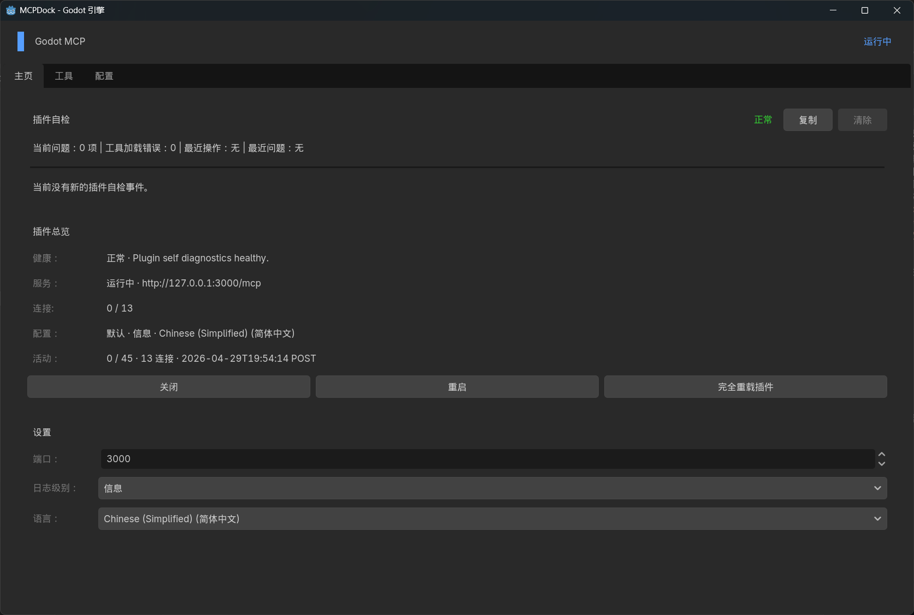
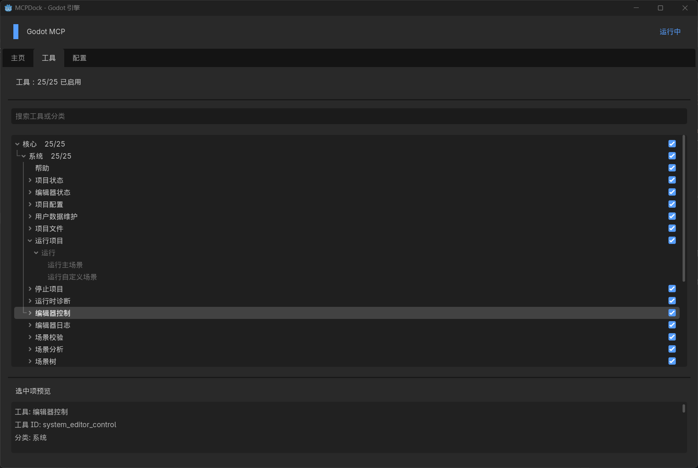
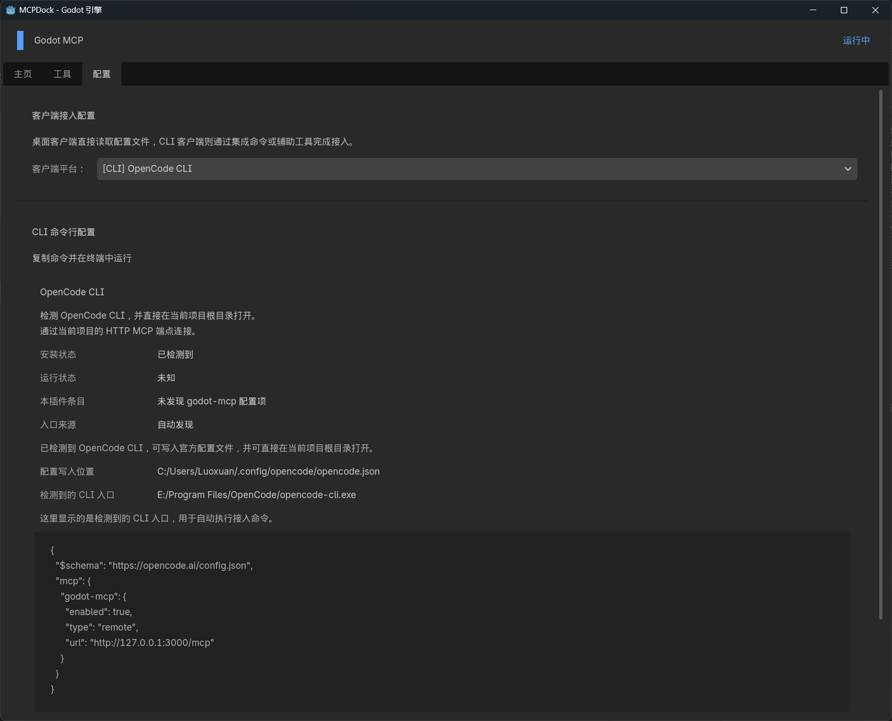

<div align="center">
  <a href="#godot-net-mcp"></a>
</div>

<p align="center"><a href="https://github.com/LuoxuanLove/godot-dotnet-mcp/releases/latest"></a> <a href="https://godotengine.org/"></a> <a href="https://dotnet.microsoft.com/"></a> <a href="https://godotengine.org/asset-library/asset/4923"></a> <a href="LICENSE"></a></p>

<p align="center"><a href="README.md">English</a> | <a href="README.zh-CN.md">中文</a></p>

| 主页 | 工具 | 配置 |
|---|---|---|
|  |  |  |

# Godot .NET MCP

Godot .NET MCP 是面向 Godot 4.6+ .NET 项目的编辑器内 MCP 插件。它直接运行在 Godot 编辑器里，将实时项目上下文提供给支持 MCP 的客户端，包括编辑器状态、当前场景、选中节点、运行信息、诊断结果和截图。

MCP 服务内置在 Godot 插件里。你只需要启用插件并从 Dock 启动服务，无需再运行额外的后台程序。

## 为什么需要它

Godot 项目不只是一堆 `.tscn`、`.tres` 和脚本文件。

你正在看的场景、当前选中的节点、编辑器输出、游戏运行时画面与状态、最近报错和插件配置，都会影响一次修改该怎么做。Godot .NET MCP 会整理这些编辑器内上下文并提供给 MCP 客户端，让它不再只靠目录快照猜测项目状态。

如果你的工作主要发生在 Godot 编辑器和游戏运行时中，而不只是代码文件中，这个插件会很有用。

## 亮点

|       | 特性 | 功能说明 |
| :---: | :--- | :--- |
| 🎛️ | **编辑器内本地 MCP 插件** | MCP 服务由 Godot 插件直接提供，无需再运行额外后台程序。 |
| 🚀 | **安装简单** | 可从 Godot 插件商城安装，也可复制 `addons/godot_dotnet_mcp/` 源文件到项目中。 |
| 🔄 | **最新 GitHub 代码** | 已复制的插件可通过常规编辑器或图形界面文件更新，也可在适合时使用 MCP 项目文件工具保持同步。 |
| 🎮 | **实时 Godot 编辑器上下文** | 将当前场景、选中节点、Dock 状态、日志、运行信息和编辑器截图提供给你的 Agent。 |
| 🌳 | **场景与资源工作流** | 辅助查看场景树、资源引用、依赖关系和场景结构问题。 |
| ▶️ | **游戏运行时支持** | 启动和停止场景，查看运行时诊断，执行输入，并捕获游戏运行时画面。 |
| 🔎 | **基于 Roslyn 的 C# 支持** | 通过插件内部的 Roslyn 语法检查读取 C# 脚本，聚焦结构识别与诊断边界。 |
| ⚙️ | **客户端配置** | 在插件配置页为常见 MCP 客户端生成或复制连接配置，并一键打开当前项目。 |
| 🧰 | **用户扩展** | 可选地从 `custom_tools/` 热加载 `user_*` GDScript 工具。 |
| 📚 | **MCP Resources 与 Prompts** | 暴露 project info、diagnostics、scene/script/resource 读取入口，并提供工作流引导 prompt。 |

## 安装

### 从 Godot 插件商城安装

1. 在 Godot 中打开项目。
2. 打开 `AssetLib` 选项卡。
3. 搜索 `Godot .NET MCP`。
4. 安装插件。
5. 进入 `Project Settings > Plugins`，启用 `Godot .NET MCP`。
6. 打开 `MCPDock`，在 `Home` 启动服务。

### 从源码复制

将插件源码目录复制到 Godot 项目中：

```text
addons/godot_dotnet_mcp
```

然后在 `Project Settings > Plugins` 中启用插件。

## 第一次使用

1. 在 Godot 4.6+ .NET 项目中安装并启用插件。
2. 打开 `MCPDock`。
3. 在 `Home` 启动 MCP 服务。
4. 在配置页为你的 MCP 客户端生成或复制配置。
5. 回到客户端并连接服务，让它读取当前 Godot 项目状态。

## 文档

- [English README](README.md)
- [更新日志](CHANGELOG.zh-CN.md)
- [文档概述](docs/概述.md)
- [安装与发布](docs/架构/安装与发布.md)
- [用户扩展](docs/模块/用户扩展.md)

## 闲聊环节 (Author's Note)

虽然我只是一名学生，但我对做游戏非常热情。我一个人古法编程写过一整个音游项目，实话说，纠结代码的细节与调试是一种折磨。

在 AI 时代，一切都改变了，代码变得廉价。发现 Agent 与 MCP 等伟大的概念之后，我欣喜若狂，希望 AI 能简单迅速地实现我的灵感，并自主完成设计、开发、验证等一切。

在简单尝试了一些其他 Godot MCP 后，我放弃了它们。面对我变化万千的游戏需求，已有的 MCP 就像只能拧固定螺丝的螺丝刀，完全不够用。

我决定自己编写这款 MCP 插件，并亲自使用它编写我的游戏。这款伟大的插件将经过我本人的实战验证，我会在前面为你踩坑、打磨、修复它。

试试 Godot .NET MCP，它将成为你的 Agent 与游戏项目之间最紧密的连接。

说句题外话，像 oh-my-openagent 这样伟大的开源项目，是我崇敬并努力追赶的目标。它的作者们使用 AI 建起了一座华丽的宫殿，并用严谨的工作流打磨每一处细节。通过参考 oh-my-openagent 的工作流，我学到了很多。

同时，我也正在使用 opencode + oh-my-openagent 开发这款插件。本项目 100% 的代码都是直接由 AI 生成的。我本人其实并不懂 GDScript。但我保证，这个 README 是我亲自审核并大幅重写过的。

听起来很自大吗？也许是。如果你有更牛逼的实现思路，那就交 PR，热烈欢迎！

## 许可证

MIT。见 [LICENSE](LICENSE)。
