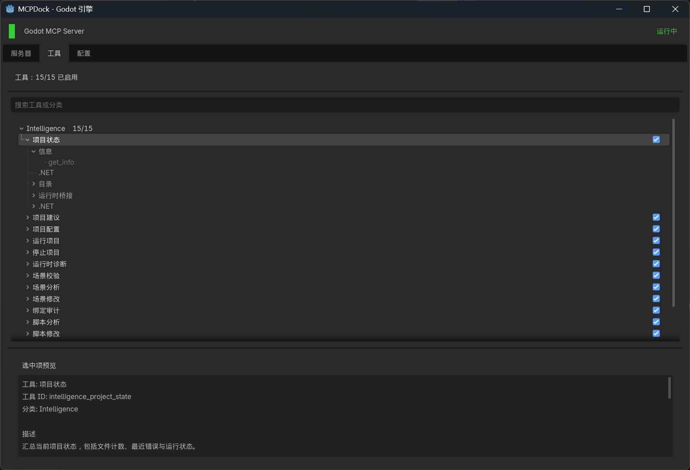

# Godot .NET MCP
[](https://github.com/LuoxuanLove/godot-dotnet-mcp/releases/latest)
[](README.md)

> 插件内 MCP 服务端：Roslyn 语法分析运行在 Godot .NET 运行时内部。



## 产品模型

- Godot 插件通过 HTTP 在进程内暴露 MCP 端点。
- C# 分析使用插件内 Roslyn（纯语法，syntax-first）。
- `system_*` 工具从运行中的 Godot 进程内部读取实时编辑器状态。
- 无子进程兜底。

## 仓库结构

- `addons/godot_dotnet_mcp/`
  Godot 插件本体：MCP HTTP 服务端、工具路由、运行时服务及插件内 Roslyn façade。
- `dotnet_bridge/`
  供插件 façade 使用的共享 Roslyn 语法核心。
- `tests/godot_plugin_harness/`、`tests/godot_plugin_harness_fixture/`
  用于插件运行时验证的 Headless Harness。
- `docs/`
  架构、模块与发布文档。

## 安装

### 方式一：发布包

从 Releases 页面下载：

```text
https://github.com/LuoxuanLove/godot-dotnet-mcp/releases
```

解压后保持目录结构：

```text
addons/godot_dotnet_mcp
```

然后：

1. 用 Godot 打开项目。
2. 进入 `Project Settings > Plugins`。
3. 启用 `Godot .NET MCP`。
4. 打开 `MCPDock`。
5. 在 `Server` 页签中启动服务。

### 方式二：源码 / 开发流程

将插件复制到 Godot 项目：

```text
addons/godot_dotnet_mcp
```

然后按上述步骤 1-5 启用。

## 环境要求

- Godot `4.6+`（需 .NET 支持，即 Mono/.NET build）
- 可接入的 MCP 客户端，例如 Claude Code、Codex CLI、Gemini CLI、Claude Desktop 或 Cursor

## 快速开始

### 1. 启用插件

以下实时编辑器工具依赖插件：

- `system_project_state`
- `system_runtime_diagnose`
- `system_scene_analyze`
- `system_script_analyze`
- `system_bindings_audit`

### 2. 连接 MCP 客户端

MCP 端点为 `http://127.0.0.1:3000/mcp`（或 `MCPDock > Server` 中显示的当前端口）。

将 MCP 客户端配置连接到该 HTTP 端点即可。

### 3. 验证

- `GET http://127.0.0.1:3000/health` 返回正常。
- `GET http://127.0.0.1:3000/api/tools` 返回工具列表。

## 自定义工具

用户扩展放在：

```text
addons/godot_dotnet_mcp/custom_tools/
```

每个 `.gd` 文件应实现 `handles()`、`get_tools()`、`execute()`，工具名统一以 `user_` 开头。

## 架构说明

- C# 解析由运行在 Godot .NET 运行时内的插件内 Roslyn 处理。
- 分析为纯语法优先：只提取语法树信息，无 SemanticModel 或项目编译。
- `dotnet_bridge/` 目录包含共享库。
- 无 attach 协议、无子进程，插件完全自包含。

## 文档入口

- [README.md](README.md)
- [addons/godot_dotnet_mcp/README.zh-CN.md](addons/godot_dotnet_mcp/README.zh-CN.md)
- [docs/概述.md](docs/概述.md)
- [docs/架构/概述.md](docs/架构/概述.md)
- [docs/架构/安装与发布.md](docs/架构/安装与发布.md)
